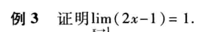
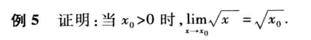
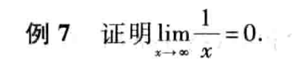

# 函数的极限

$define$

$
设函数f(x)在点x_0的某去心邻域内有定义。如果存在常数A，对于任意给定的正数\varepsilon \\（无论它多么小）总存在正数\delta，使得当x满足不等式0<|x-x_0|<\delta 时，对应的函数值f(x)都满足不等式
$

$$
|f(x)-A|<\varepsilon
$$

$那么常数A就叫做函数f(x)当x\rightarrow x_0时的极限$

$$
\lim_{x\rightarrow x_0}f(x)=A
$$

**简写为**

$$
\lim_{x\rightarrow x_0}f(x)=A\Leftrightarrow \forall  \varepsilon>0,\exists \delta >0,当0<|x-x_0|<\delta，有|f(x)-A|<\varepsilon
$$

### 例题

$由于|f(x)-A|=|2x-1-1|=2|x-1|$

$为了使2|x-1|<\varepsilon$

$只要|x-1|<\frac{\varepsilon}{2}$

$所以\forall \varepsilon >0,可取\delta = \frac{\varepsilon}{2},当x满足不等式0<|x-1|<\delta$

$从而\lim_{x\rightarrow 1}(2x-1)=1$

$由于|f(x)-A|=|\sqrt{x}-\sqrt{x_0}|=|\frac{x-x_0}{\sqrt{x}+\sqrt{x_0}}|\leqslant \frac{1}{\sqrt{x_0}}|x-x_0|$

$要使|f(x)-A|<\varepsilon，只要|x-x_0|<\sqrt{x_0}\varepsilon，且x\geqslant 0$

$由|x-x_0|\leqslant x_0，可得x\geqslant 0$

$可得\delta=\min \{x_0,\sqrt{x_0}\varepsilon\}$

$所以\lim_{x\rightarrow x_0}\sqrt{x}=\sqrt{x_0}$

## 左极限和右极限

$$
左极限：\lim_{n\rightarrow x_0}f(x)=A\Leftrightarrow \forall  \varepsilon>0,\exists \delta >0,当x_0-\delta<x<x_0，有|f(x)-A|<\varepsilon
\\记作f(x^-)=A
$$

$$
右极限：\lim_{n\rightarrow x_0}f(x)=A\Leftrightarrow \forall  \varepsilon>0,\exists \delta >0,当0<x<x_0+\delta，有|f(x)-A|<\varepsilon
\\记作f(x^+)=A
$$

***极限存在** 的 **充分必要** 条件是左极限和右极限各自存在并且相等*

## 自变量趋于无穷大时的极限

$$
\lim_{x\rightarrow \infin}f(x)=A\Leftrightarrow \forall  \varepsilon>0,\exists X >0,当|x|>X，有|f(x)-A|<\varepsilon
$$

### 例题

$\forall \varepsilon >0,要证\exist X>0,当|x|>X$

$$
|\frac{1}{x}-0|<\varepsilon成立

$$

$即|x|>\frac{1}{\varepsilon},取X=\frac{1}{\varepsilon}$

## 函数极限的性质

- 极限的唯一性 

  $如果\lim_{x\rightarrow x_0}存在，那么这极限唯一$

- 函数极限的局部有界性
  
  $如果\lim_{x\rightarrow x_0}f(x)=A，那么存在常数M>0和\delta >0,使得当0<|x-x_0|<\delta，有|f(x)|\leqslant  M$

- 函数极限的局部保号性
 
  $如果\lim_{x_\rightarrow x_0}f(x)=A,A>0(A<0),那么存在常数\delta>0，使得当0<|x-x_0|<\delta,有f(x)>0(<0)$

  $推论：如果在x_0的某去心领域内f(x)\geqslant 0(\leqslant 0)，而且\lim_{x\rightarrow x_0}f(x)=A,那么A\geqslant 0(\leqslant 0)$

- 函数极限和数列极限的关系
  $如果极限\lim_{x\rightarrow x_0}f(x)存在，\{x_n\}为函数f(x)的定义域内任一收敛于x_0的数列，\\且满足：x_n \neq x_0(n\in N_+)，那么相应的函数值数列\{f(x_n)\}必收敛，且\lim_{n\rightarrow \infty}f(x_n)=\lim_{x\rightarrow x_0}f(x)$