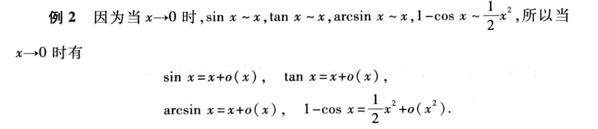
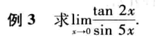
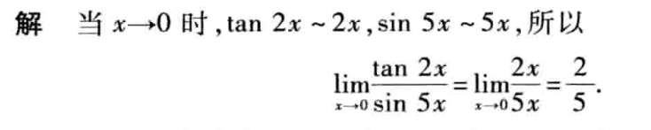
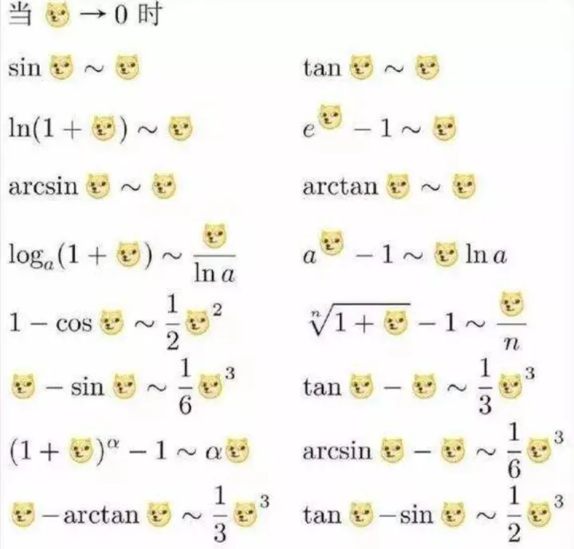

# 无穷小的比较

- $\lim\frac{\beta}{\alpha}=0，\beta 是\alpha 高阶无穷小,记作\beta = o(\alpha)$
- $\lim\frac{\beta}{\alpha}=\infty，\beta 是\alpha 低阶无穷小$
- $\lim\frac{\beta}{\alpha}=c\neq 0，\beta 是\alpha 同阶无穷小$
- $\lim\frac{\beta}{\alpha^k}=c\neq 0，\beta 是\alpha k阶无穷小$
- $\lim\frac{\beta}{\alpha}=1，\beta 是\alpha 等价无穷小，记作\alpha \sim \beta$

## 等价无穷小

$定理一$

$$
\beta 与\alpha 是等价无穷小的充分必要条件为\\
\beta = \alpha+o(\alpha)
$$

$定理二$

$$
设\alpha\sim\tilde{\alpha},\beta\sim\tilde{\beta},且\lim\frac{\tilde{\beta}}{\tilde{\alpha}},则\\
\lim \frac{\beta}{\alpha}=\lim \frac{\tilde{\beta}}{\tilde{\alpha}}
$$

例

## 等价无穷小替换公式

