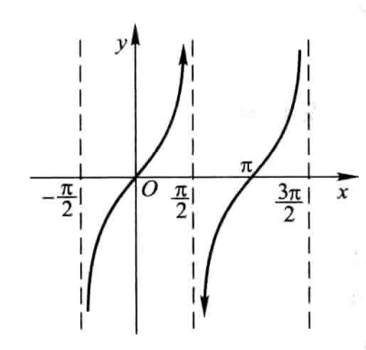
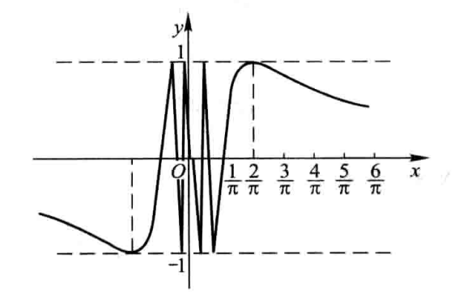
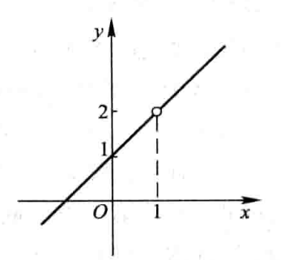
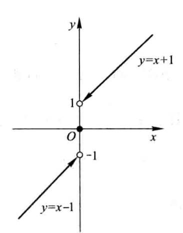

# 函数的连续性与间断点

## 连续

$define$

$$
函数f(x)在点x_0的某一领域内有定义，如果\\
\lim_{\Delta x\rightarrow 0}\Delta y=\lim_{\Delta x\rightarrow 0}[f(x_0+\Delta x)-f(x_0)]=0\\
那么就说函数在点x_0处连续
$$

$简单来说$

$$
函数f(x)在点x_0的某一处领域内有定义，如果\\
\lim_{\Delta x\rightarrow 0}\Delta f(x)=f(x_0)\\
那么就说函数在点x_0处连续
$$

### 左连续和右连续

$$
左连续f(x_0^-)=f(x_0)
$$

$$
右连续f(x_0^+)=f(x_0)
$$

## 间断点

- 无穷间断点
  
  正切函数$y=\tan x$在$x=\frac{\pi}{2}$处没有定义，并且$\lim_{x\rightarrow \frac{\pi}{2}}=\tan x=\infty$

  

- 震荡间断点

   函数$y=\sin \frac{1}{x}$在$x=0$处没有定义，并且函数值在-1和+1之间变动无限多次

   

- 可去间断点

  函数$y=\frac{x^2-1}{x-1}$在点 $x=1$没有定义,所以在点 $x=1$处是不连续的，但

  $$
    \lim_{x\rightarrow 1}\frac{x^2}{x-1}=\lim_{x\rightarrow 1}(x+1)=2
  $$

  补充x=1时，y=2，那么就连续了

  

- 跳跃间断点

    函数的左右极限都存在，但并不相等

    

### 第一类间断点

左右极限都存在，就是第一类间断点

- **可去间断点是第一类间断点**

### 第二类间断点
    
不是第一类就是第二类

- **无穷间断点**

- **震荡间断点**

- **跳跃间断点**