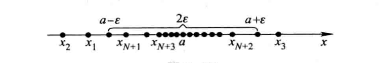
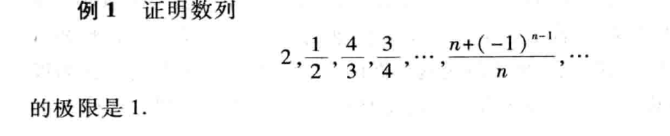

# 数列的极限

$define$

$设 \{ x_n\} 为一数列，如果存在常数 a，对任意给定的正数 \varepsilon（无论它多么小），\\
总存在正整数 N，使得当 n > N 时，不等式$

$$
|x_n-a|<\varepsilon
$$

$都成立，那么就称常数a是数列\{x_n\}的极限，或称数列收敛于a$

$$
\lim_{n\rightarrow \infin}=a
$$

$发散：不存在这样的常数a，也就是极限不存在$

**简写为**

$$

\lim_{n\rightarrow \infin}=a\Leftrightarrow \forall  \varepsilon>0,\exists 正整数N,当n>N时，有|x_n-a|<\varepsilon
$$

## 几何解释

$将数列表示出来，再在数轴上做点a的\varepsilon邻域$

$不等式|x_n-a|<\varepsilon与不等式a-\varepsilon<x_n<a+\varepsilon等价$

*当n>N时有无限个点落在区间内，而只有有限个（最多N个落在区间外）*

## 例题

$|x_n-a|=|\frac{n+(-1)^{n-1}}{n}|=\frac{1}{n}$

$\forall \ \varepsilon,为了使|x_n-a|<\varepsilon$

$\frac{1}{n}<\varepsilon$

$n>\frac{1}{\varepsilon}$

$任取一个大于\frac{1}{\varepsilon}的正整数N，当n>N时$

$|\frac{n+(-1)^{n-1}}{n}-1|<\varepsilon$

$即极限等于1$

## 收敛函数的性质

- 极限的唯一性

    $$
    如果数列\{x_n\}收敛，那么他的极限唯一
    $$

- 收敛函数的有界性

    $$
    如果数列\{x_n\}收敛，那么数列一定有界
    $$

    $对于数列\{x_n\}如果存在正数M,使得一切x_n都满足|x_n|\leqslant M$

    $那么数列就是有界的，否则就是无界的$

    **注意：数列有界时数列收敛的必要条件，不是充分条件**

- 收敛函数的保号性

    $$
    如果\lim_{n\rightarrow \infin}=a，且a>0（或<0），\\那么存在正整数N，当n<N时，都有x_n>0（或<0）
    $$

    $$
    推论：如果数列\{x_n\}从某项起有x_n\geqslant 0（或\leqslant 0），\\且\lim_{n\rightarrow \infin}=a，那么a\geqslant 0（或a\leqslant 0）
    $$

- 收敛数列与其子数列间的关系
  
  $$
  如果数列\{x_n\}收敛于a，那么它的任一子数列也收敛，且极限也是a
  $$

  $$子数列：在数列中任意抽取无限多项且保持这些项在原数列中的先后次序$$

