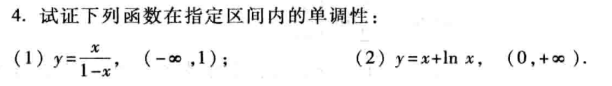
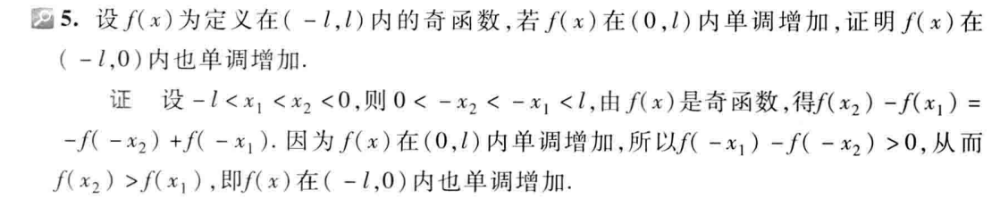

$（1）证明$：

$在(-\infin,1)取x_1和x_2，且x_2>x_1$

$y_1=\frac{x_1}{1-x_1}$

$y_2=\frac{x_2}{1-x_2}$

$y_2-y_1=\frac{x_2}{1-x_2}-\frac{x_1}{1-x_1}\\
=\frac{x_2-x_1}{(1-x_1)(1-x_2)}$

$因为x_2-x_1>0,(1-x_1)>0,(1-x_2)>0$

$所以y_2-y_1>0,单调递增$

