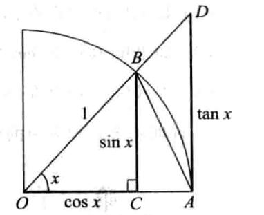

# 极限存在准则和两个重要极限

## 准则一（夹逼准则）

$$
如果数列\{x_n\},\{y_n\}以及\{z_n\}满足以下条件\\
(1)从某项起，即\exist n_0\in \mathbf{N}_+，当n>n_0时有\\
y_n \leqslant x_n \leqslant z_n\\
(2)\lim_{n\rightarrow \infty}y_n=a,\lim_{n\rightarrow \infty}z_n=a\\
那么数列极限存在，且等于a
$$

### 重要极限$\lim_{x\rightarrow 0}\frac{\sin x}{x}=1$

#### 证明

$\sin x=CB,x=\overset{\LARGE{\frown}}{AB},\tan x = AD$

$因为\Delta AOB的面积 < 小于扇形AOB的面积 < \Delta AOD的面积$

$\sin x<x<\tan x$

$两边各除以\sin x$

$1<\frac{x}{\sin x}<\frac{1}{\cos x}$

$\cos x<\frac{\sin x}{x}<1$

$下面来证明\lim_{x\rightarrow 0}\cos x=1$

$当0<|x|<\frac{\pi}{2}$

$0<|\cos x -1|=1-\cos x=2\sin^2\frac{x}{2}<2(\frac{x}{2})^2=\frac{x^2}{2}$

$当x\rightarrow 0,\frac{x^2}{2}\rightarrow 0$

$由夹逼准则有\lim_{x\rightarrow 0}(1-\cos x)=0$

$由夹逼准则有\lim_{x\rightarrow 0}\frac{\sin x}{x}=1$

## 准则二（单调有界数列必有极限）

### 重要极限$\lim_{x\rightarrow \infin}(1+\frac{1}{x})^x=\mathrm{e}$

### 柯西极限存在准则

$$
数列\{x_n\}收敛的充分必要条件是：对于任意给定的正数\varepsilon,存在正整数N,\\使得当m>N,n>M时有\\
|x_n-X_m|<\varepsilon
$$