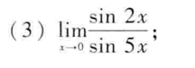
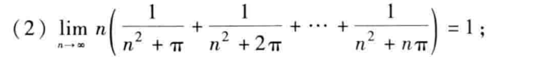
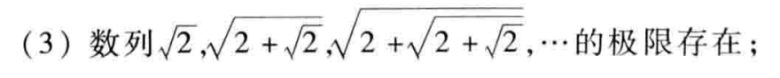
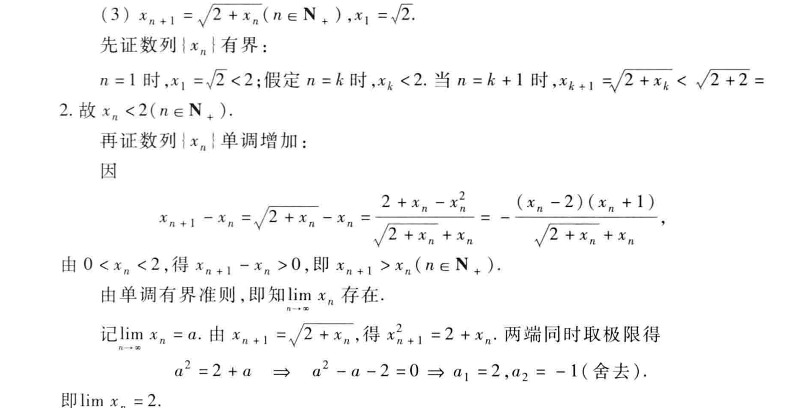

$原式=\frac{2}{5}\lim_{x\rightarrow 0}\frac{\sin 2x}{2x}\cdot\frac{5x}{\sin 5x}=\frac{2}{5}$

$\lim_{n\rightarrow \infty}n(\frac{n}{n^2+n\pi})\leqslant原式\leqslant \lim_{n\rightarrow \infty}n(\frac{n}{n^2})$

