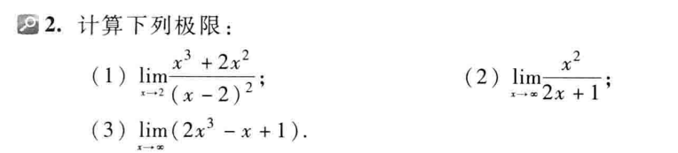
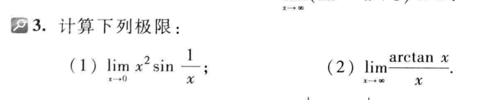
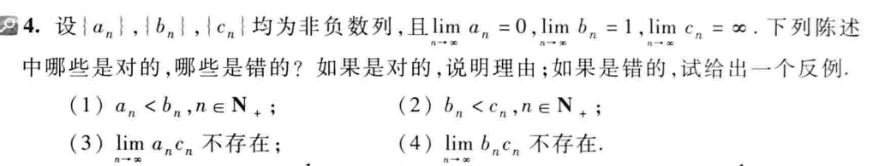
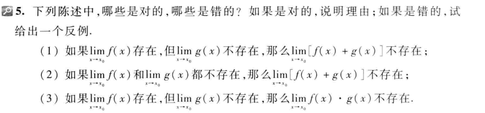
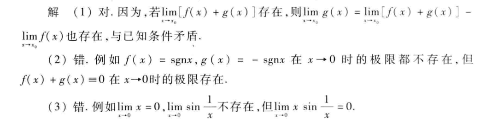

$(1)因为\lim_{x\rightarrow 2}\frac{(x-2)^2}{x^3+2x^2}=0$

$所以\lim_{x\rightarrow 2}\frac{x^3+2x^2}{(x-2)^2}=\infty$

其它几道题一样的做法

$(1)因为-1<\sin \frac{1}{x}<1,所以原式=0$

(1)极限的运算法则有这样一条：$如果\varphi (x)\geqslant \psi(x),而\varphi (x)=A,\psi(x)=B,那么A>B$。
反过来成立

